# Infrastructure Diagram

This diagram shows all GCP resources created by the driftlessaf Terraform configuration.

```mermaid
flowchart TB
    subgraph External
        GH[GitHub Webhooks]
    end

    subgraph "Cloud Run Services"
        subgraph "GitHub Events Trampoline"
            GHE_C1[driftless-github-events<br/>us-central1]
            GHE_E4[driftless-github-events<br/>us-east4]
        end

        subgraph "CloudEvent Broker Ingress"
            BRK_C1[driftlessaf<br/>us-central1]
            BRK_E4[driftlessaf<br/>us-east4]
        end

        subgraph "PR Events Workqueue Subscriber"
            PRSUB_C1[pr-events<br/>us-central1]
            PRSUB_E4[pr-events<br/>us-east4]
        end

        subgraph "PR Reconciler Workqueue"
            WQRCV_C1[pr-logger-wq-rcv<br/>us-central1]
            WQRCV_E4[pr-logger-wq-rcv<br/>us-east4]
            WQDSP_C1[pr-logger-wq-dsp<br/>us-central1]
            WQDSP_E4[pr-logger-wq-dsp<br/>us-east4]
        end

        subgraph "PR Reconciler"
            REC_C1[pr-logger-rec<br/>us-central1]
            REC_E4[pr-logger-rec<br/>us-east4]
        end
    end

    subgraph "Cloud Run Jobs"
        REENQ[pr-logger-wq-reenqueue<br/>us-central1]
    end

    subgraph "Pub/Sub Topics (Broker)"
        TOPIC_C1[driftlessaf-us-central1]
        TOPIC_E4[driftlessaf-us-east4]
    end

    subgraph "Pub/Sub - PR Events Workqueue"
        PRSUB_SUB_C1[pr-events-us-central1-0]
        PRSUB_SUB_E4[pr-events-us-east4-0]
        PRSUB_DLQ_C1[pr-events-us-central1-0-dlq]
        PRSUB_DLQ_E4[pr-events-us-east4-0-dlq]
    end

    subgraph "Pub/Sub - Workqueue Change Notifications"
        WQTOPIC_C1[pr-logger-wq-global-us-central1]
        WQTOPIC_E4[pr-logger-wq-global-us-east4]
        WQSUB_C1[pr-logger-wq-global-us-central1 sub]
        WQSUB_E4[pr-logger-wq-global-us-east4 sub]
    end

    subgraph "Pub/Sub - Event Recorder (per event type x2 regions)"
        REC_SUBS[20 subscriptions<br/>github-events-recorder-*<br/>write to GCS]
        REC_DLQ[20 DLQ topics + subs<br/>github-events-recorder-dlq-*]
    end

    subgraph "Cloud Storage"
        WQBKT[pr-logger-wq-6ct2oc<br/>Workqueue State]
        RECBKT_C1[github-events-recorder-us-central1-73af<br/>Event JSON Files]
        RECBKT_E4[github-events-recorder-us-east4-73af<br/>Event JSON Files]
    end

    subgraph "BigQuery"
        BQDS[cloudevents_github_events_recorder dataset]
        subgraph "Tables (10 event types)"
            BQT1[dev_chainguard_github_check_run]
            BQT2[dev_chainguard_github_check_suite]
            BQT3[dev_chainguard_github_issue_comment]
            BQT4[dev_chainguard_github_issues]
            BQT5[dev_chainguard_github_projects_v2_item]
            BQT6[dev_chainguard_github_pull_request]
            BQT7[dev_chainguard_github_pull_request_review]
            BQT8[dev_chainguard_github_pull_request_review_comment]
            BQT9[dev_chainguard_github_push]
            BQT10[dev_chainguard_github_workflow_run]
        end
        BQDTS[20 Data Transfer Jobs<br/>GCS → BigQuery<br/>every 15 minutes]
    end

    subgraph "Cloud Scheduler"
        CRON_C1[pr-logger-wq-cron-us-central1<br/>Dispatch trigger]
        CRON_E4[pr-logger-wq-cron-us-east4<br/>Dispatch trigger]
        REENQ_CRON[pr-logger-wq-reenqueue-cron<br/>Re-enqueue stale items]
    end

    subgraph "Secret Manager"
        SECRET[driftlessaf-github-app-private-key]
    end

    %% Data Flow - Webhook to Broker
    GH -->|POST webhook| GHE_C1
    GH -->|POST webhook| GHE_E4
    GHE_C1 -->|CloudEvent| BRK_C1
    GHE_E4 -->|CloudEvent| BRK_E4
    BRK_C1 -->|publish| TOPIC_C1
    BRK_E4 -->|publish| TOPIC_E4

    %% Data Flow - PR Events Workqueue
    TOPIC_C1 -->|filter: pullrequesturl| PRSUB_SUB_C1
    TOPIC_E4 -->|filter: pullrequesturl| PRSUB_SUB_E4
    PRSUB_SUB_C1 -->|push| PRSUB_C1
    PRSUB_SUB_E4 -->|push| PRSUB_E4
    PRSUB_SUB_C1 -.->|failures| PRSUB_DLQ_C1
    PRSUB_SUB_E4 -.->|failures| PRSUB_DLQ_E4
    PRSUB_C1 -->|gRPC enqueue| WQRCV_C1
    PRSUB_E4 -->|gRPC enqueue| WQRCV_E4

    %% Data Flow - Workqueue to Reconciler
    WQRCV_C1 -->|write state| WQBKT
    WQRCV_E4 -->|write state| WQBKT
    WQBKT -->|GCS notification| WQTOPIC_C1
    WQBKT -->|GCS notification| WQTOPIC_E4
    WQTOPIC_C1 --> WQSUB_C1
    WQTOPIC_E4 --> WQSUB_E4
    WQSUB_C1 -->|push| WQDSP_C1
    WQSUB_E4 -->|push| WQDSP_E4
    CRON_C1 -->|trigger| WQDSP_C1
    CRON_E4 -->|trigger| WQDSP_E4
    WQDSP_C1 -->|gRPC process| REC_C1
    WQDSP_E4 -->|gRPC process| REC_E4
    REC_C1 -->|read state| WQBKT
    REC_E4 -->|read state| WQBKT

    %% Reconciler external calls
    REC_C1 -->|GitHub API| GH
    REC_E4 -->|GitHub API| GH
    SECRET -->|env var| REC_C1
    SECRET -->|env var| REC_E4

    %% Re-enqueue job
    REENQ_CRON -->|trigger| REENQ
    REENQ -->|scan & requeue| WQBKT

    %% Data Flow - Event Recorder
    TOPIC_C1 -->|filter: type| REC_SUBS
    TOPIC_E4 -->|filter: type| REC_SUBS
    REC_SUBS -->|cloud_storage_config| RECBKT_C1
    REC_SUBS -->|cloud_storage_config| RECBKT_E4
    REC_SUBS -.->|failures| REC_DLQ
    RECBKT_C1 --> BQDTS
    RECBKT_E4 --> BQDTS
    BQDTS --> BQDS
    BQDS --> BQT1
    BQDS --> BQT2
    BQDS --> BQT3
    BQDS --> BQT4
    BQDS --> BQT5
    BQDS --> BQT6
    BQDS --> BQT7
    BQDS --> BQT8
    BQDS --> BQT9
    BQDS --> BQT10
```

## Resource Summary

### Cloud Run Services (12 total, 6 per region)

| Service | Purpose |
|---------|---------|
| `driftless-github-events` | GitHub webhook receiver, converts to CloudEvents |
| `driftlessaf` | CloudEvent broker ingress |
| `pr-events` | Workqueue subscriber, filters PR-related events |
| `pr-logger-wq-rcv` | Workqueue receiver, accepts enqueue requests |
| `pr-logger-wq-dsp` | Workqueue dispatcher, triggers reconciler |
| `pr-logger-rec` | PR reconciler, processes PR events |

### Cloud Run Jobs (1)

| Job | Purpose |
|-----|---------|
| `pr-logger-wq-reenqueue` | Re-enqueues stale workqueue items |

### Pub/Sub Topics (26 total)

| Topic Pattern | Count | Purpose |
|---------------|-------|---------|
| `driftlessaf-{region}` | 2 | CloudEvent broker |
| `pr-events-{region}-0-dlq` | 2 | PR workqueue dead letter |
| `pr-logger-wq-global-{region}` | 2 | Workqueue GCS notifications |
| `github-events-recorder-dlq-*` | 20 | Recorder dead letter (10 types x 2 regions) |

### Pub/Sub Subscriptions (46 total)

| Subscription Pattern | Count | Purpose |
|----------------------|-------|---------|
| `pr-events-{region}-0` | 2 | Push to pr-events subscriber |
| `pr-events-{region}-0-dlq` | 2 | Dead letter pull |
| `pr-logger-wq-global-{region}` | 2 | Push to workqueue dispatcher |
| `github-events-recorder-*` | 20 | Write to GCS (10 types x 2 regions) |
| `github-events-recorder-dlq-*` | 20 | Dead letter pull |

### Cloud Storage Buckets (3)

| Bucket | Purpose |
|--------|---------|
| `pr-logger-wq-*` | Workqueue state storage |
| `github-events-recorder-us-central1-*` | Event JSON files (central) |
| `github-events-recorder-us-east4-*` | Event JSON files (east) |

### BigQuery

| Resource | Count | Purpose |
|----------|-------|---------|
| Dataset | 1 | `cloudevents_github_events_recorder` |
| Tables | 10 | One per GitHub event type |
| Data Transfer Jobs | 20 | GCS → BQ import (10 types x 2 regions) |

### Cloud Scheduler Jobs (3)

| Job | Purpose |
|-----|---------|
| `pr-logger-wq-cron-us-central1` | Trigger dispatcher periodically |
| `pr-logger-wq-cron-us-east4` | Trigger dispatcher periodically |
| `pr-logger-wq-reenqueue-cron` | Trigger re-enqueue job |

### Secret Manager (1)

| Secret | Purpose |
|--------|---------|
| `driftlessaf-github-app-private-key` | GitHub App authentication |
