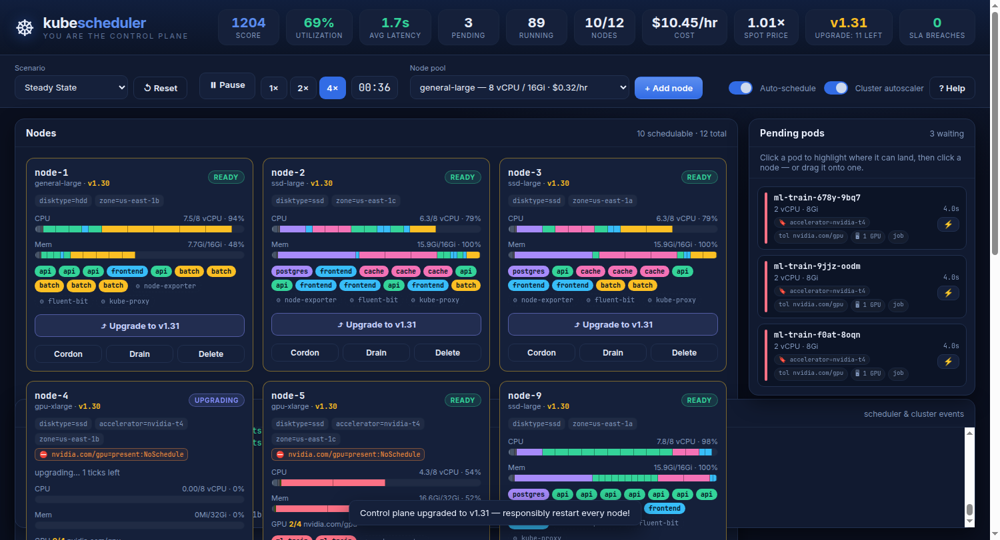

# ☸ kubescheduler — the game

A browser game where **you are the Kubernetes scheduler _and_ the cluster operator**.

Pods stream into the cluster and you must bind each one to a node that satisfies all of
its constraints — resource requests, `nodeSelector`s, taints/tolerations, and pod
anti-affinity — while deciding when to **provision new nodes** and when to **cordon, drain,
and terminate** the ones you no longer need. Your score rewards low **scheduling latency**
and high **utilization**, and punishes wasted spend, SLA breaches, and disruptive evictions.

You'll also have to handle the things that make running a real cluster hard:
**DaemonSets** that put per-node overhead on every machine, **spot nodes** that are dirt cheap
at a fluctuating price but get **reclaimed without warning**, and **Kubernetes version upgrades**
that force you to responsibly restart every node without dropping your workloads.



It is written in **zero-dependency vanilla ES modules** (no framework, no build step) and
ships with a tiny built-in static server, so it runs anywhere Node is installed.

---

## Run it

```bash
cd k8s-scheduler-game
node server.js          # serves http://localhost:8080  (set PORT to change)
# or: npm start
```

Then open the printed URL. No `npm install` required — there are no dependencies.

> Prefer Python? `python3 -m http.server 8080` works too. (A static server is needed
> because the game uses native ES modules, which browsers won't load over `file://`.)

---

## How to play

1. **Click** a pending pod in the right-hand queue to select it. Every node that can host it
   lights up **green**; nodes that can't are dimmed and show the **blocking reason** (e.g.
   _insufficient memory_, _untolerated taint_, _didn't match selector `disktype=ssd`_).
2. **Click a green node** — or **drag the pod onto it** — to bind it.
3. Or press **⚡** on a pod to auto-place just that one on its best-fit node.

Keep the queue empty, keep nodes busy, and don't overspend.

### The constraints (the same ones real `kube-scheduler` enforces)

| Constraint | What it means in the game |
| --- | --- |
| **Resource requests** | A pod's CPU / memory / GPU requests must fit in the node's free capacity. |
| **nodeSelector** | The node must carry the required label, e.g. `disktype=ssd`, `accelerator=nvidia-t4`. |
| **Taints & tolerations** | A node's `NoSchedule` taint (`nvidia.com/gpu`, `spot`) blocks pods that don't tolerate it. |
| **Pod anti-affinity (hard)** | Two replicas of the same app may **not** share a node (used by `postgres`). |
| **Pod anti-affinity (soft / spread)** | The scheduler _prefers_ to spread replicas across nodes (used by `frontend`/`api`); influences scoring, never blocks. |
| **Cordon / not-ready** | Cordoned or still-booting nodes won't accept new pods. |

### Curveballs

- **DaemonSets** ⚙ — the controller automatically runs node agents (`node-exporter`,
  `fluent-bit`, `kube-proxy`, and a GPU `nvidia-device-plugin` on GPU nodes) on **every**
  matching node. They tolerate every taint, can't be moved, and consume capacity everywhere —
  so they're per-node overhead that rewards running **fewer, larger** nodes. `kubectl drain`
  leaves them alone; they're recreated whenever a node joins or finishes an upgrade.
- **Spot nodes** ⚡ — `spot-medium`/`spot-large` cost a fraction of on-demand, but they're
  billed at a **fluctuating spot price** and the cloud can **reclaim them at any time**. You get
  a brief **Reclaiming** countdown to drain them gracefully; if you don't, their pods are
  evicted back to the queue. Only put fault-tolerant work (e.g. `batch`) on spot.
- **Cluster upgrades** — every so often the control plane jumps a minor version and every node
  falls behind (its version badge turns amber). Restart them **responsibly** — a few at a time,
  so workloads always have somewhere to land — using each node's **⤴ Upgrade** button (drain +
  reboot onto the new version). Out-of-date nodes bleed score until the rollout finishes, and
  completing the whole fleet pays a bonus.

### Operating the cluster

- **➕ Add node** — provision capacity from a node pool. New nodes spend time **Provisioning**
  (and cost money the whole time) before they go **Ready**.
- **Cordon** — mark a node unschedulable without disturbing its running pods.
- **Drain** — cordon **and** gracefully evict its **workload** pods back to the queue (small
  penalty); DaemonSet pods stay put.
- **⤴ Upgrade** — appears on out-of-date nodes: drains then reboots the node onto the current
  Kubernetes version.
- **Delete** — terminate a node. Any pods still on it are **force-killed** (big penalty) — so
  drain first!

Flip on **Auto-schedule** and **Cluster autoscaler** to watch a baseline policy play the game —
it auto-places pods, scales capacity, recovers from spot reclaims, and performs a safe **rolling
upgrade** when a new version lands — then turn them off and try to beat it by hand.

---

## Scoring

Each tick you **earn** for cluster **utilization** and **lose** for **pending pods**
(scheduling latency pressure) and **node cost**:

```
score += utilization × 30
       − pendingPods × 1.5
       − (Σ node $/hr) × 0.6
```

Plus one-off effects: finishing a job **+8**, a graceful drain eviction **−2/pod**, a forced
kill **−10/pod**, an SLA breach (a pod left pending too long) **−40**, a spot reclaim **−1.5/pod**,
and—while an upgrade is pending—**−0.3/tick** for every node still out of date, offset by a
**+35** bonus when the whole fleet finishes the rollout. Spot nodes are billed at the **live
spot price**, so cheap capacity gets pricier (and more interruption-prone) when the market spikes.

The headline KPIs in the top bar are the ones the prompt asks you to optimize:

- **Utilization** — average CPU+memory packing across the nodes you're paying for.
- **Avg latency** — mean time pods waited in `Pending` before being scheduled.
- …alongside pending/running counts, ready/total nodes, hourly cost, **spot price**, the current
  **cluster version** (with how many nodes still need upgrading), and SLA breaches.

---

## Scenarios

| Scenario | Description |
| --- | --- |
| **Steady State** | Balanced, predictable workload. Good for learning. |
| **Traffic Spike** | Calm baseline punctuated by big `frontend`/`api` surges — scale up fast, scale down after. |
| **GPU Crunch** | Steady services plus periodic ML training jobs that demand GPU nodes you must provision. |
| **Production Chaos** | Everything at once, high churn across every workload type. Hard mode. |

Workloads are minted from `Deployment`-like templates with bounded replica counts (so the
cluster reaches a steady state), and the arrival stream is seeded for reproducible runs. Every
scenario also throws periodic **cluster upgrades** at you (more often in Chaos), and spot
interruptions can strike whenever you're running spot capacity.

---

## Project layout

```
k8s-scheduler-game/
├── index.html            # markup + KPI/toolbar/grid/queue/log scaffolding
├── styles.css            # dark "control-plane" dashboard theme
├── server.js             # zero-dependency static dev server (Node built-ins only)
├── src/
│   ├── types.js          # instance types, app templates, units & helpers
│   ├── scheduler.js      # predicate filtering + scoring (pure, unit-tested)
│   ├── workload.js       # seeded PRNG, scenarios, pod generator
│   ├── engine.js         # game state, tick loop, node lifecycle, scoring, autopilot
│   ├── ui.js             # DOM rendering + click/drag interaction
│   └── main.js           # boots the engine + UI and drives the clock
├── test/
│   └── scheduler.test.mjs  # unit + soak + balance tests (node --test)
└── tools/
    └── browser-smoke.mjs   # optional headless-Chrome end-to-end check
```

The simulation core (`types`, `scheduler`, `workload`, `engine`) is completely UI-agnostic and
pure where it counts, which is why it can be unit-tested under Node without a browser.

---

## Tests

```bash
npm test          # node --test — predicate, engine, soak & balance tests (no browser, no deps)
```

The suite covers the scheduling predicates (resources, selectors, taints, anti-affinity,
cordon), engine actions (schedule/drain/evict/job-completion), the autoscaler, **DaemonSet**
reconciliation and overhead, **spot** reclamation and price bounds, **node upgrades** (drain +
reboot, rollout-completion bonus, and the autopilot's rolling upgrade), determinism of the
workload generator, a long "soak" run that asserts the cluster never overcommits a node, and a
balance check that every scenario stays healthy under full automation.

An optional end-to-end check drives the real UI in headless Chrome (no npm deps — it uses
Node's built-in `fetch`/`WebSocket` over the DevTools Protocol):

```bash
node server.js &                                   # start the server
APP_URL=http://localhost:8080/ npm run smoke       # boot the UI, click-schedule, screenshot
```
