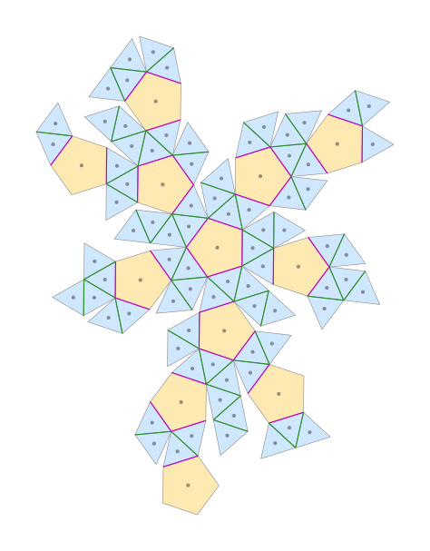
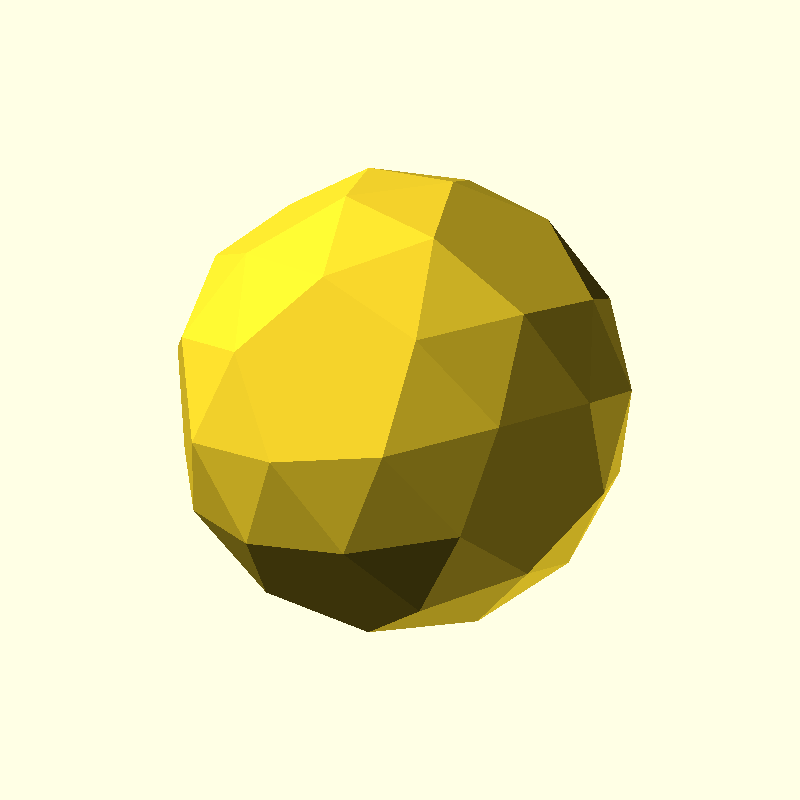
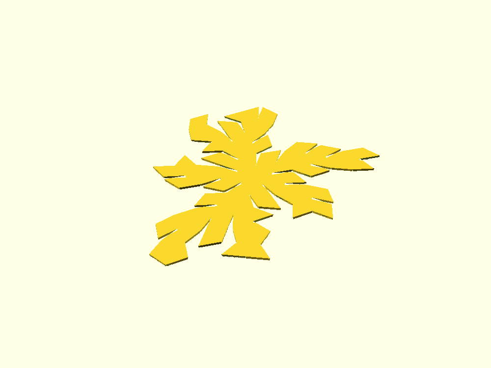

# Foldable snub dodecahedron net

Generate a **3D-printable flat net** of a [snub
dodecahedron](https://en.wikipedia.org/wiki/Snub_dodecahedron) that you print
in one (or a few) flat pieces, then **fold along beveled hinges and glue** into
the finished Archimedean solid.

This was inspired by the Wikipedia net
[`Snub_dodecahedron_flat.svg`](https://commons.wikimedia.org/wiki/File:Snub_dodecahedron_flat.svg).
Rather than tracing that bitmap-ish SVG, the geometry here is generated from the
**exact** coordinates of the snub dodecahedron, so every face is a perfect
regular polygon and every fold angle is computed from the solid's true dihedral
angles.

| The flat net (one piece) | A single fold groove | Folds into this |
|---|---|---|
|  |  |  |

The 92 faces (12 pentagons + 80 triangles) unfold into a **single
non-overlapping net** with 91 fold hinges and 59 glue seams. Pentagons are
shown orange, triangles blue; green fold lines are triangle–triangle edges and
magenta fold lines are triangle–pentagon edges.

The actual generated 3D plate (grooves cut on the inner side):



## How the folding works

The net prints as a flat plate of thickness `T`:

```
 z = T   outer surface of the finished solid  (stays continuous over folds)
 z = 0   inner surface                        (the V-grooves open here)
```

To fold two adjacent panels from flat (180°) to the solid's interior dihedral
angle `θ`, a V-groove is removed from the **inner** side along the shared edge.
When the groove closes, the panels sit at `θ`. A thin **web** of material is
left at the top as a living hinge.

```
fold angle  = 180° − θ
each groove wall is cut at   γ = (fold + slack) / 2   from vertical
groove half-width at base    w = (T − web) · tan(γ)
```

The snub dodecahedron has exactly two distinct dihedral angles, so two groove
sizes are produced automatically:

| Edge type | Dihedral `θ` | Fold (180−θ) |
|---|---|---|
| triangle–triangle | **164.175°** | 15.825° |
| triangle–pentagon | **152.930°** | 27.070° |

`slack` (default **6°**) makes every groove slightly wider than strictly
necessary. The panels can then always reach `θ` — in fact they can over-close
by `slack` degrees — so any small gap at the target angle is simply filled with
glue. This follows the "leave more room than necessary" bias: it is far easier
to fill a gap with glue than to fight a groove that closes too early.

Glue seams (edges where two far-apart parts of the net meet only after folding)
are chamfered on each mating face by the same `γ`, so the two faces end up
coplanar and glue flush at the correct angle.

## Requirements

This project is run with [uv](https://docs.astral.sh/uv/). The Python scripts
carry [inline dependency metadata (PEP 723)](https://docs.astral.sh/uv/guides/scripts/),
so `uv run` automatically creates an isolated environment with `numpy`/`scipy`
on first use — there is nothing to install manually.

```bash
# install uv (see https://docs.astral.sh/uv/getting-started/installation/)
curl -LsSf https://astral.sh/uv/install.sh | sh    # or: pip install uv

# OpenSCAD is only needed to render STLs (the .scad is written regardless)
sudo apt-get install openscad                      # or https://openscad.org
```

## Usage

```bash
# default: 30 mm edges, 12 mm thick, magnet pockets, single net -> out/snub_net.scad
uv run generate.py

# pick your own size/depth and also render an STL
uv run generate.py --edge 35 --depth 14 --web 0.4 --slack 6 --stl

# fit a print bed: split into the fewest, balanced pieces that fit 7x7 in
uv run generate.py --bed 7x7in --stl

# split into smaller pieces (≤ 20 faces each) for easier printing/handling
uv run generate.py --max-faces-per-piece 20 --stl

# also export the target solid as a reference model
uv run generate.py --solid
```

Open the generated `.scad` in OpenSCAD (or use `--stl`) to get a mesh, then
slice and print.

### Parameters

| Flag | Default | Meaning |
|---|---|---|
| `--edge` | `30` | edge length of every polygon (mm) — sets overall size |
| `--depth` / `--thickness` | `12` | plate depth / material thickness `T` (mm) — thick, rigid panels |
| `--web` | `0.4` | living-hinge web left at the top of each groove (mm), ~1–2 print layers |
| `--slack` | `6` | extra fold opening added to every groove (degrees) |
| `--over` | `0.4` | run grooves this far past each vertex for a clean fold (mm) |
| `--magnet-diameter` | `3.175` | magnet pocket diameter (mm) — default 1/8 in |
| `--magnet-depth` | `1.5875` | magnet pocket depth (mm) — default 1/16 in |
| `--no-magnets` | off | do not pocket magnet holes in the faces |
| `--bed` | — | print-bed size, e.g. `7x7in` or `180x180` (mm); fit pieces to it |
| `--bed-margin` | `5` | keep pieces this far inside each bed edge (mm) |
| `--max-faces-per-piece` | — | split the net into pieces of at most N faces |
| `--no-boundary-bevel` | off | leave glue-seam edges square instead of chamfered |
| `--solid` | off | also export the reference snub dodecahedron solid |
| `--stl` | off | render an STL via the `openscad` CLI |
| `--out` | `out/snub_net` | output path prefix |

## Fitting your print bed

`--bed` splits the model into the **fewest pieces that fit your bed**, with a
**roughly equal number of faces per piece**. Give the bed size as `WxH` with an
optional unit (`in` = inches, otherwise mm): `--bed 7x7in`, `--bed 180x180`,
`--bed 7in` (square). `--bed-margin` (default 5 mm) keeps pieces inside the bed
edges (room for a skirt/brim).

Each piece is rotated to its best-fit orientation, and the tool reports each
piece's footprint and confirms it fits:

```
4 piece(s), 92 faces, 88 fold hinges, 62 glue seams, 0 overlapping face pairs
  piece 0: 25 faces,  163.6 x  165.9 mm  FITS BED
  piece 1: 25 faces,  163.4 x  164.2 mm  FITS BED
  piece 2: 25 faces,  157.8 x  157.4 mm  FITS BED
  piece 3: 17 faces,  131.6 x  132.4 mm  FITS BED
```

In any multi-piece mode you get one **standalone, bed-centered `.scad` per
piece** (`<out>_piece00.scad`, `_piece01.scad`, …) so you can print them one at
a time; with `--stl` each piece is rendered to its own STL. The combined
`<out>.scad` and the `_preview.svg` (which draws each piece inside a dashed bed
rectangle) are still written for an overview. Fold and glue the pieces, then
glue the pieces to each other along their matching beveled seam edges.

## Printing & assembly

1. **Orientation:** print the plate **inner (grooved) side down** on the bed.
   Every bevel wall is within ~`γ` of vertical (< ~20°), so the grooves are
   self-supporting — **no support material needed**.
2. **Material:** PLA/PETG work. The default `--web 0.4` (≈1–2 layers at a
   0.2 mm layer height) leaves a thin, easy-to-bend living hinge between the
   thick rigid panels. Set your slicer's layer height so the web is a whole
   number of layers (e.g. 0.4 mm web at 0.2 mm layers). For repeated folding or
   brittle filament, increase `--web`; for an even easier single fold, drop it
   toward one layer.
3. **Fold** each hinge until the groove walls meet (or until the faces look
   right). The grooves are valley folds toward the inner side.
4. **Glue** the 59 seams (and the hinge grooves, if you want a rigid result).
   The chamfered seam faces meet flush; fill any slack gap with glue.

Tip for choosing a size: the finished solid's circumradius is about
`2.16 × edge`, so its overall diameter is about `4.31 × edge`. So 30 mm edges
give a ball roughly 130 mm across.

## Magnets

Each face gets a cylindrical magnet pocket centered on its **exterior**
surface (`z = T`, the continuous outer side — the *opposite* side from the
inner fold grooves). The default pocket is **1/8 in diameter × 1/16 in deep**
(`3.175 mm × 1.5875 mm`); change it with `--magnet-diameter` / `--magnet-depth`,
or disable with `--no-magnets`.

Because the exterior side faces **up** when you print grooved-side-down, the
pockets are simple top-opening cavities — printable with no supports. Drop a
disc magnet into each pocket (a dab of glue holds it). Mind magnet polarity if
you want neighboring solids (or the folded faces) to attract rather than repel.

If you want the magnet flush or slightly recessed, set `--magnet-depth` to your
magnet's thickness; for a press-fit, shrink `--magnet-diameter` by ~0.1 mm, or
leave it slightly oversized and glue (the "leave more room" bias).

## Files

| File | Purpose |
|---|---|
| `snubgeom.py` | exact snub dodecahedron geometry; self-verifies counts, edge lengths and dihedral angles |
| `unfold.py` | unfolds the solid into non-overlapping flat net piece(s) |
| `scadgen.py` | turns a net into beveled, grooved OpenSCAD |
| `preview.py` | SVG preview of the net + independent overlap check |
| `generate.py` | command-line driver tying it all together |

## Verification

Running any of the scripts re-verifies the geometry: 60 vertices, 150 edges,
92 faces (12 pentagons + 80 triangles), all edges equal length, and dihedral
angles matching the known 164.175° / 152.930°. The unfolder additionally runs
an independent SAT overlap check to confirm no two faces overlap in the layout.

```bash
uv run snubgeom.py     # prints the verified geometry stats
uv run preview.py      # writes net_preview.svg, reports overlapping pairs (0)
```
